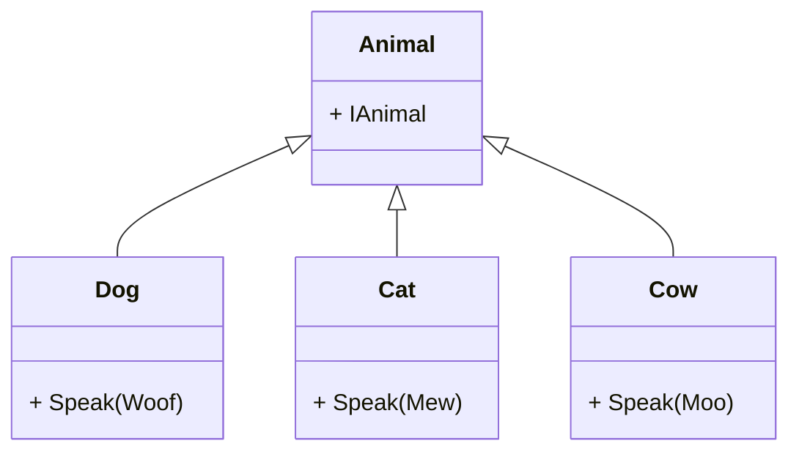

Class Work project

```mermaid
classDiagram
    Animal <|-- Dog
    Animal <|-- Cat
    Animal <|-- Cow
    Animal: + IAnimal
    class Dog{
        +  Speak(Woof)
    }
    class Cat{
        + Speak(Mew)
    }
    class Cow{
        + Speak(Moo)
    }
```
