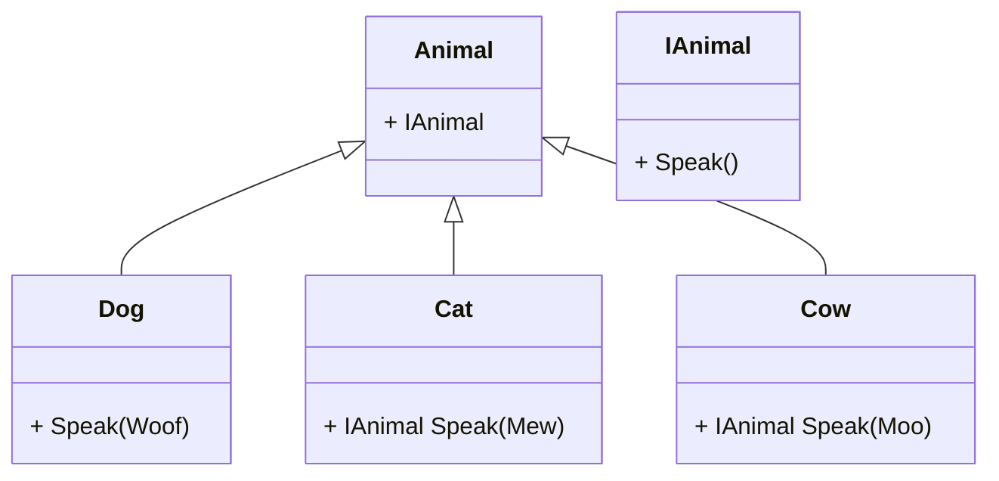

Class Work project

```mermaid
classDiagram
    Animal <|-- Dog
    Animal <|-- Cat
    Animal <|-- Cow
    Animal: + IAnimal
    IAnimal: + Speak()
    class Dog{
        +  Speak(Woof)
    }
    class Cat{
        + IAnimal Speak(Mew)
    }
    class Cow{
        + IAnimal Speak(Moo)
    }
```
